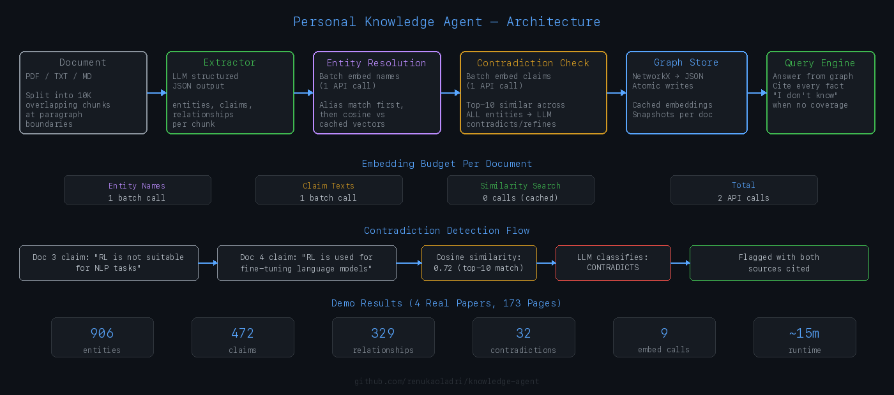
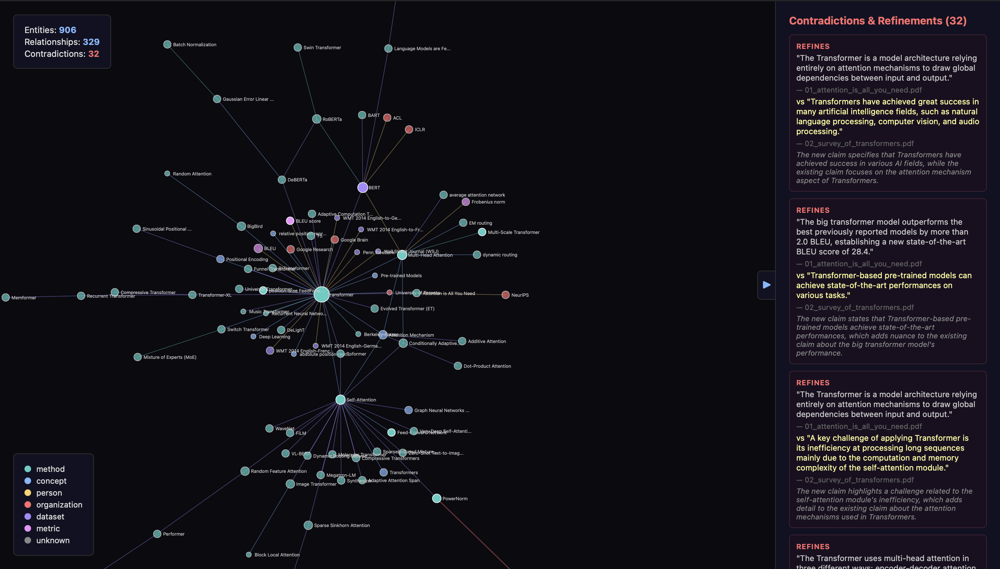

# Personal Knowledge Agent

Builds a persistent belief graph from a sequence of documents. Extracts entities and claims, resolves duplicates semantically, detects contradictions across entities, answers questions with source citations.



## Quick Start

```bash
pip install -r requirements.txt
cp .env.example .env          # add OPENROUTER_API_KEY
python run.py                  # ingest → detect contradictions → query → visualize
python run.py --interactive    # interactive query mode after ingestion
```

Runs on CPU. All LLM and embedding work goes through OpenRouter API.

## Adding Your Own Documents

Drop `.pdf`, `.txt`, or `.md` files into `documents/`. Files are ingested in alphabetical order — prefix with numbers for chronological control (`01_first.pdf`, `02_second.pdf`). Already-ingested files are skipped on re-run.

To start fresh:

```bash
rm -f results/graph.json && rm -rf results/graph_snapshots/*
python run.py
```

## How It Works

```
Document → Chunked Extraction → Batch Entity Resolution → Contradiction Check → Graph Store
                                                                                      ↓
                                                                               Query Engine
```

**Extraction.** Documents are split into overlapping 10K-char chunks at paragraph boundaries. Each chunk gets an LLM call with structured JSON output returning entities, claims, and relationships. Results are deduplicated across chunks.

**Entity resolution.** Two-pass: exact alias match first, then cosine similarity against cached entity embeddings (threshold 0.75). One batch embedding call per document. All similarity math runs locally against cached vectors.

**Contradiction detection.** New claim texts are batch-embedded (one API call), compared against all cached claim embeddings by cosine similarity (local math), and the top-10 most similar existing claims — regardless of entity — are sent to the LLM for classification as confirms, refines, contradicts, or unrelated.

**Query engine.** Filters the graph to relevant entities by name and alias overlap, constructs context from matching claims and detected conflicts, asks the LLM to answer with per-fact source citations. Returns "I don't know" when the graph has no relevant coverage.

**Embedding budget: 2 API calls per document regardless of size.** One batch for entity names, one for claim texts. A 91-page paper uses the same number of embedding calls as a 2-page abstract.

## Results

Tested on 4 real research papers (173 pages total, ~15 min runtime):

| Paper | Pages | Entities | Claims | Conflicts |
|-------|-------|----------|--------|-----------|
| Attention Is All You Need (2017) | 15 | 28 | 25 | 0 |
| A Survey of Transformers (2021) | 40 | 175 | 122 | 12 |
| A Survey of RLHF (2023) | 91 | 691 | 278 | 2 |
| Direct Preference Optimization (2023) | 27 | 42 | 47 | 18 |

**Final: 906 entities, 472 claims, 329 relationships, 32 conflicts. 9 total embedding API calls.**

Validated:
- **Cross-entity contradictions caught.** "RL is not suitable for NLP" (RLHF survey) vs "RL is used for fine-tuning language models" (DPO paper) — different entities, direct conflict, flagged.
- **Refinements distinguished from contradictions.** RLHF described as "promising" (survey) and "complex and unstable" (DPO paper) — classified as refinement, not contradiction.
- **No false positives between agreeing sources.** Attention paper and Transformer survey: 0 false contradictions.
- **Coverage gaps handled.** "What is the capital of France?" → "I don't know — the knowledge graph has no relevant coverage."
- **Entity resolution doesn't over-merge.** PPO/PPG stay separate (0.667 similarity). DPO/Direct Policy Optimization stay separate (0.786). Threshold is 0.75.

## Visualization



`results/graph.html` is generated at the end of each run. Open in any browser.

- Nodes float continuously, sized by claim count, colored by entity type
- Scroll to zoom, drag to pan, drag nodes to reposition
- Collapsible sidebar lists all conflicts with source citations
- Hover nodes for details

Regenerate independently: `python visualize.py`

## Configuration

| Variable | Default | Description |
|----------|---------|-------------|
| `OPENROUTER_API_KEY` | required | OpenRouter API key |
| `OPENROUTER_MODEL` | `openai/gpt-4o-mini` | LLM for extraction, contradiction, queries |
| `OPENROUTER_EMBEDDING_MODEL` | `openai/text-embedding-3-small` | Embedding model for similarity |

## File Structure

```
src/
  llm_client.py         shared client, retry, batch embed, cosine similarity
  extractor.py           chunked extraction with deduplication
  graph_store.py         persistent graph, cached embeddings, batch entity resolution
  contradiction.py       cross-entity detection via embedding similarity
  ingest.py              orchestrator (2 embed calls per doc)
  query.py               graph-first answers with citations
documents/               source documents (PDF, TXT, MD)
results/
  graph.json             knowledge graph with cached embeddings
  graph.html             interactive D3 visualization
  graph_snapshots/       graph state after each document
```

## Limitations

- **Extraction quality.** gpt-4o-mini occasionally miscategorizes entity types or misses implicit claims. Switching to gpt-4o improves accuracy at higher cost.
- **Entity resolution threshold.** Set at 0.75. If distinct concepts collapse into one node, raise toward 0.85. If the same concept appears as separate nodes with different names, lower toward 0.65. Inspect the graph after ingestion — fragmented nodes with overlapping claims mean too high, conflated nodes with unrelated claims mean too low.
- **Latency on large documents.** A 91-page paper needs 40 extraction LLM calls (~8 min). Embedding and contradiction checking add ~2 min. Cost is ~$0.10 per paper with gpt-4o-mini.
- **Graph file size.** Cached embeddings (1536 floats per claim) grow the JSON file. For corpora beyond ~50 documents, replace with a vector database.
- **No cross-claim inference.** The system detects direct contradictions and refinements. It does not infer transitive contradictions (A contradicts B, B implies C, therefore A contradicts C).
